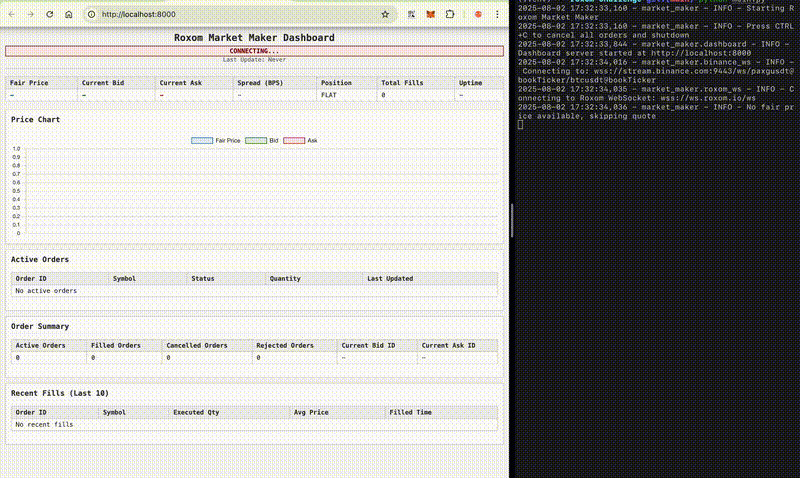

# Roxom Market Maker

A market making bot that quotes bid/ask prices for GOLD-BTC on Roxom exchange based on real-time Binance data.



## Quick Start

**Prerequisites:** Python 3.8+

1. **Install:**
```bash
git clone git@github.com:ignimbrite/roxom-challenge.git
cd roxom-challenge
pip install -r requirements.txt
```

2. **Configure** `settings.py` (see [Configuration Options](#configuration-options) below)

3. **Run:**
```bash
python main.py
```

Dashboard available at `http://localhost:8000`

Press `Ctrl+C` to stop and cancel all orders.

## How It Works

- Fetches PAXG/USDT and BTC/USDT prices from Binance WebSocket
- Calculates GOLD-BTC fair price: `(PAXG/USDT) / (BTC/USDT)`
- Places bid/ask orders with configurable spread every X seconds
- Monitors fills and position via Roxom REST/WebSocket APIs
- Provides real-time dashboard for monitoring

## Architecture

**Async event-driven** with concurrent loops:
- **Trading loop**: Places/cancels orders every X seconds based on fair price
- **Market data**: Binance WebSocket feeds for PAXG/USDT and BTC/USDT prices  
- **Account monitoring**: Roxom WebSocket for real-time order status updates
- **Position polling**: REST API calls to track current position

**Shared state objects:**
- `MarketDataState`: Latest Binance bid/ask prices
- `AccountDataState`: Live order status and fill history

**Key components:**
- `strategy/market_maker.py`: Main trading logic
- `strategy/pricing.py`: Fair price calculation (PAXG÷BTC) 
- `strategy/orders.py`: Order management
- `market_data/binance_ws.py`: Binance WebSocket client
- `roxom/roxom_client.py`: Roxom REST API client
- `roxom/roxom_ws.py`: Roxom WebSocket client  
- `dashboard/`: Monitoring interface

## Configuration Options

Edit `settings.py`:

```python
# Exchange
API_KEY = "your_roxom_api_key"

# Trading
SYMBOL = "GOLD-BTC"
SPREAD_BPS = 20                    
ORDER_SIZE = "1.00"
QUOTE_INTERVAL = 5
```

## Extension Points

- **Pricing**: Multiple data sources for fair price calculation
- **Position Management**: Quote skewing based on current position size
- **Volatility Controls**: Dynamic spread adjustments based on market volatility
- **Risk Management**: Shutdown mechanism when order cancellations fail or open order count exceeds safety threshold

## Roxom API Feedback

- **Instruments endpoint**: Wrong path in documentation (`https://docs.roxom.com/market-data#get-api-v1-instruments`)
- **Cancel all orders endpoint**: Should support filtering by `symbol`
- **Order price missing**: WebSocket `orders` channel should include `px` field 
- **Unnecessary status**: WebSocket `orders` channel `pendingsubmit` status adds complexity
- **Positions WebSocket needed**: Real-time position updates instead of polling REST API
